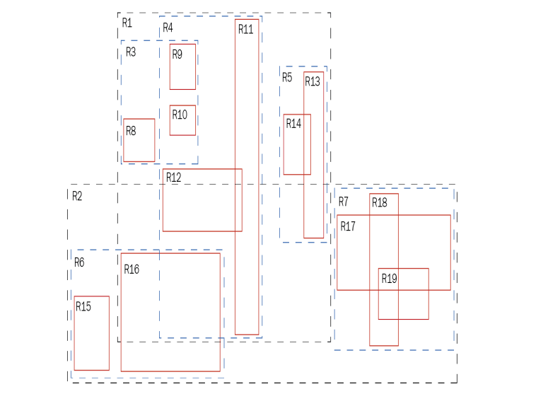
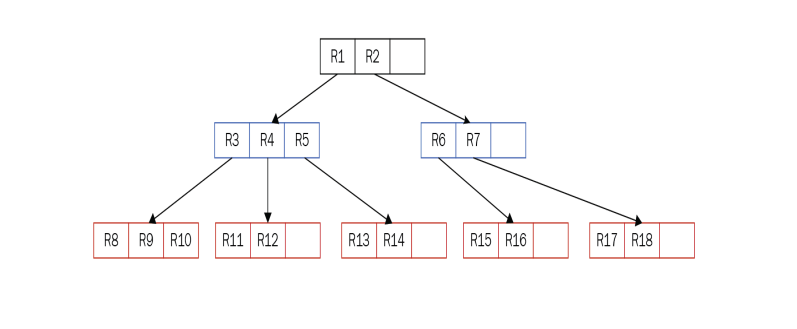

使用索引

[toc]


在第2章 "理解事务和锁定 "中，你了解了并发性和锁定。在这一章中，是时候直面索引了。这个话题的重要性怎么强调都不为过--索引是（而且很可能一直是）每个数据库工程师生活中最重要的话题之一。 

经过20多年专业的、全职的PostgreSQL咨询和PostgreSQL 24/7支持经验（www.cybertec-postgresql.com），我可以肯定地说一件事--坏的索引是性能不好的主要来源。当然，调整内存参数和所有这些是很重要的。但是，如果索引使用不当，这一切都是徒劳的。缺少索引是根本无法替代的。为了明确我的观点：如果没有适当的索引，就没有办法实现良好的性能，所以如果性能不好，一定要检查索引。 

这就是专门用一整章来讨论索引的背后原因。这将给你带来尽可能多的启示。 

在这一章中，我们将涵盖以下主题。

+ 了解简单的查询和成本模型 
+ 使用聚类表提高速度 
+ 了解额外的B-树功能 
+ 介绍运算符类 
+ 了解PostgreSQL索引类型 
+ 用模糊搜索实现更好的答案 
+ 了解全文搜索

在本章结束时，你将了解在PostgreSQL中如何有益地使用索引。


# 1 了解简单的查询和成本模型 

在本节中，我们将开始使用索引。为了了解事情是如何运作的，需要一些测试数据。下面的代码片断显示了如何轻松创建数据。

```sql
test=# DROP TABLE IF EXISTS t_test;
DROP TABLE
test=# CREATE TABLE t_test (id serial, name text);
CREATE TABLE
test=# INSERT INTO t_test (name) SELECT 'hans'
 FROM generate_series(1, 2000000);
INSERT 0 2000000
test=# INSERT INTO t_test (name) SELECT 'paul'
 FROM generate_series(1, 2000000);
INSERT 0 2000000
```

在第一行，创建了一个简单的表。使用了两列；第一列是一个自动递增列，只是不断地创建数字，第二列是一个将用静态值填充的列。

> generate_series函数将生成从1到200万的数字。因此，在这个例子中，hans的200万个静态值和paul的200万个静态值被创建了

总共添加了 400 万行：

```sql
test=# SELECT name, count(*) FROM t_test GROUP BY 1;
 name | count
------+---------
 hans | 2000000
 paul | 2000000
(2 rows)
```

这400万行有一些很好的属性，我们将在本章中使用这些属性。ID是按升序排列的数字，而且只有两个不同的名字。 

让我们运行一个简单的查询。

```sql
test=# \timing
Timing is on.
test=# SELECT * FROM t_test WHERE id = 432332;
 id | name
--------+------
 432332 | hans
(1 row)
Time: 176.949 ms
```

在这种情况下，计时命令将告诉 psql 显示查询的运行时间。

> 这不是服务器上的真实执行时间，而是psql测量的时间。如果是非常短的查询，网络延迟可能是总时间的很大一部分，所以必须考虑到这一点。

## 1.1 使用 EXPLAIN

在这个例子中，读取400万行已经花费了100多毫秒的时间。从性能的角度来看，这完全是一场灾难。为了弄清楚出了什么问题，PostgreSQL提供了EXPLAIN命令，其定义如下代码所示。

```sql
test=# \h EXPLAIN
Command: EXPLAIN
Description: show the execution plan of a statement
Syntax:
EXPLAIN [ ( option [, ...] ) ] statement
EXPLAIN [ ANALYZE ] [ VERBOSE ] statement
where option can be one of:
 ANALYZE [ boolean ]
 VERBOSE [ boolean ]
 COSTS [ boolean ]
 SETTINGS [ boolean ]
 BUFFERS [ boolean ]
 WAL [ boolean ]
 TIMING [ boolean ]
 SUMMARY [ boolean ]
 FORMAT { TEXT | XML | JSON | YAML }
URL: https://www.postgresql.org/docs/13/sql-explain.html

```

当你感觉到一个查询的性能不好时，EXPLAIN将帮助你揭示性能问题的真正原因。 

下面是它的工作原理。

```sql
test=# EXPLAIN SELECT * FROM t_test WHERE id = 432332;
 QUERY PLAN
-------------------------------------------------------------------------
 Gather (cost=1000.00..43455.43 rows=1 width=9)
 Workers Planned: 2
 -> Parallel Seq Scan on t_test (cost=0.00..42455.33 rows=1 width=9)
 Filter: (id = 432332)
(4 rows)
```

你在这个列表中看到的是一个执行计划。在PostgreSQL中，一条SQL语句将分四个阶段执行。以下组件在工作。

+ 解析器将检查语法错误和明显的问题。 
+ 重写系统负责处理规则（视图和其他东西）。 
+ 优化器将找出如何以最有效的方式执行查询，并制定一个计划。
+  优化器提供的计划将被执行器用来最终创建结果。

EXPLAIN的目的是看规划器想出了什么办法来有效地运行查询。在我的例子中，PostgreSQL将使用一个并行的顺序扫描。这意味着两个工作者将合作，一起进行过滤条件的工作。然后，部分结果会通过一个叫做聚集节点的东西联合起来，这是在PostgreSQL 9.6中引入的（它是并行查询基础设施的一部分）。如果你更仔细地看这个计划，你会看到PostgreSQL在计划的每个阶段期望有多少行（在这个例子中，行=1；也就是说，将返回一条行）。

> 在PostgreSQL 9.6到10.0中，并行工作者的数量将由表的大小决定。操作越大，PostgreSQL将启动更多的并行工作者。对于一个非常小的表，不使用并行操作，因为它将产生太多的开销。

平行性不是必须的。通过将以下变量设置为0，总是可以减少并行工作者的数量以模仿PostgreSQL 9.6之前的行为。

```sql
test=# SET max_parallel_workers_per_gather TO 0;
SET
```

请注意，这种改变没有副作用，因为它只在你的会话中发生。当然，你也可以在postgresql.conf文件中做这个改动，但我建议不要这样做，因为你可能会失去很多由并行查询提供的性能。

## 1.2 深入了解 PostgreSQL 成本模型

如果只使用一个CPU，执行计划会是这样的。

```sql
test=# EXPLAIN SELECT * FROM t_test WHERE id = 432332;
 QUERY PLAN
----------------------------------------------------------
 Seq Scan on t_test (cost=0.00..71622.00 rows=1 width=9)
 Filter: (id = 432332)
(2 rows)
```

PostgreSQL将按顺序读取（顺序扫描）整个表并应用过滤器。它预计该操作将花费71622个罚分。现在，这意味着什么呢？罚分（或成本）主要是一个抽象的概念。它们需要用来比较执行查询的不同方法。如果一个查询可以被执行器以许多不同的方式执行，PostgreSQL将通过承诺最低的成本来决定执行计划。现在的问题是，PostgreSQL是如何得到71622分的？ 

下面是它的工作原理。

```sql
test=# SELECT pg_relation_size('t_test') / 8192.0;
 ?column?
--------------------
 21622.000000
(1 row)
```

pg_relation_size函数将返回表的大小，单位是字节。鉴于这个例子，你可以看到这个关系由21622个块组成（每个块8000个）。根据成本模型，PostgreSQL将为每一个必须按顺序读取的块增加一个成本。 

影响这一点的配置参数如下。

```sql
test=# SHOW seq_page_cost;
 seq_page_cost
---------------
 1
(1 row)
```

然而，从磁盘上读取几个块并不是我们要做的全部。还需要应用过滤器，并通过CPU发送这些行。下面的代码块中显示的两个参数说明了这些成本。

```sql
test=# SHOW cpu_tuple_cost;
 cpu_tuple_cost
----------------
 0.01
(1 row)
test=# SHOW cpu_operator_cost;
 cpu_operator_cost
-------------------
 0.0025
(1 row)
```

这导致以下计算：

```sql
test=# SELECT 21622*1 + 4000000*0.01 + 4000000*0.0025;
 ?column?
------------
 71622.0000
(1 row)
```

正如你所看到的，这正是计划中所显示的数字。成本将由CPU部分和I/O部分组成，它们都将被转化为一个数字。这里重要的是，成本与实际执行无关，所以不可能将成本转化为毫秒。计划员得出的数字其实只是一个估计值。 

当然，在这个简短的例子中还概述了一些参数。 PostgreSQL对与索引有关的操作也有特殊的参数，如下所示

+ random_page_cost = 4：如果PostgreSQL使用了一个索引，通常会涉及大量的随机I/O。在传统的旋转磁盘上，随机读取要比顺序读取重要得多，所以PostgreSQL会相应地考虑它们。注意，在SSD上，随机读和顺序读之间的差别已经不存在了，所以在postgresql.conf文件中设置random_page_cost = 1可能是有意义的。 
+ cpu_index_tuple_cost = 0.005。如果使用了索引，PostgreSQL也会认为有一些CPU成本的开销

如果你正在利用并行查询，则有更多的成本参数。

+ parallel_tuple_cost = 0.1：这定义了将一个元组从一个并行工作进程转移到另一个进程的成本。它基本上说明了在基础设施内移动行的开销。 
+ parallel_setup_cost = 1000.0：这调整了启动一个工作进程的成本。当然，启动进程来并行运行查询不是免费的，所以这个参数试图模拟那些与进程管理相关的成本。 
+ min_parallel_tables_scan_size = 8 MB：这定义了一个被考虑用于并行查询的表的最小尺寸。一个表增长得越大，PostgreSQL将使用更多的CPU。表的大小必须是三倍，以允许多一个工作进程。 
+ min_parallel_index_scan_size = 512kB：这定义了一个索引的大小，这是考虑并行扫描所必须的。

## 1.3 部署简单索引

发动更多的工作进程来扫描更大的表，有时并不是解决办法。读取整个表来寻找单行通常不是一个好主意。 

因此，创建索引是有意义的。

```sql
test=# CREATE INDEX idx_id ON t_test (id);
CREATE INDEX
test=# SELECT * FROM t_test WHERE id = 43242;
 id | name
-------+------
 43242 | hans
(1 row)
Time: 0.259 ms
```

PostgreSQL使用Lehman-Yao的高并发B树来做标准索引（https://www.csd.uoc.gr/~hy460/pdf/p650-lehman.pdf）。连同一些PostgreSQL特有的优化，这些树为终端用户提供了出色的性能。最重要的是，Lehman-Yao允许你同时在同一个索引上运行许多操作（读和写），这有助于极大地提高吞吐量。

然而，索引并不是免费的。

```sql
test=# \di+
 List of relations
 Schema | Name | Type | Owner | Table | Persistence | Size | Description
--------+--------+-------+-------+--------+-------------+-------+-------------
 public | idx_id | index | hs | t_test | permanent | 86 MB |
(1 row)
```

正如你所看到的，我们的包含400万行的索引将占用86MB的磁盘空间。除此以外，对表的写入也会变慢，因为索引必须一直保持同步。 

换句话说，如果你插入到一个具有20个索引的表中，你还必须记住，我们必须在INSERT时向所有这些索引写入，这就严重降低了写入速度

> 随着版本11的引入，PostgreSQL现在支持并行索引创建。它可以利用一个以上的CPU核心来建立索引，从而大大加快了这个过程。目前，只有当你想建立一个普通的B树时才有可能，还没有对其他索引类型的支持。然而，这在将来很可能会改变。用于控制并行程度的参数是max_parallel_maintenance_workers。它告诉PostgreSQL它可以使用多少个进程作为一个上限。

## 1.4 使用排序输出

B 树索引不仅用于查找行；它们还用于将排序后的数据提供给流程的下一阶段：

```sql
test=# EXPLAIN SELECT *
 FROM t_test
 ORDER BY id DESC
 LIMIT 10;
 QUERY PLAN
---------------------------------------------------------------
 Limit (cost=0.43..0.74 rows=10 width=9)
 -> Index Scan Backward using idx_id on t_test
 (cost=0.43..125505.43 rows=4000000 width=9)
(2 rows)

```

在这种情况下，索引已经按照正确的排序顺序返回数据，因此没有必要对整个数据集进行排序。读取索引的最后10行就足以回答这个查询。实际上，这意味着有可能在几分之一秒的时间内找到一个表的前N行。 

然而，ORDER BY并不是唯一需要排序输出的操作。 min和max函数也都是关于排序输出的，所以索引也可以用来加快这两个操作的速度。下面是一个例子

```sql
test=# explain SELECT min(id), max(id) FROM t_test;
 QUERY PLAN
--------------------------------------------------------------
 Result (cost=0.92..0.93 rows=1 width=8)
 InitPlan 1 (returns $0)
 -> Limit (cost=0.43..0.46 rows=1 width=4)
 -> Index Only Scan using idx_id on t_test
 (cost=0.43..113880.43 rows=4000000 width=4)
 Index Cond: (id IS NOT NULL)
 InitPlan 2 (returns $1)
 -> Limit (cost=0.43..0.46 rows=1 width=4)
 -> Index Only Scan Backward using idx_id on t_test t_test_1
 (cost=0.43..113880.43 rows=4000000 width=4)
 Index Cond: (id IS NOT NULL)
(9 rows)
```

在PostgreSQL中，一个索引（更准确的说是一个B-树）可以按正常顺序或向后读取。现在的问题是，B树可以被看作是一个排序的列表。 所以，很自然地，最低值在开始，最高值在结束。因此，min和max是加速的最佳选择。同样值得注意的是，在这种情况下，主表根本不需要被引用。 

在SQL中，许多操作都依赖于排序的输入；因此，理解这些操作是至关重要的，因为在索引方面有严重的影响。

## 1.5 一次使用多个索引

到现在为止，你已经看到一次使用一个索引了。 然而，在许多现实世界的情况下，这远远不够。 有一些情况需要在数据库中使用更多的逻辑。 

PostgreSQL允许在一个查询中使用多个索引。当然，如果许多列同时被查询，这是有意义的。然而，情况并不总是这样的。也可能发生这样的情况：一个索引被多次使用来处理同一个列。 

下面是一个例子。

```sql
test=# explain SELECT * FROM t_test WHERE id = 30 OR id = 50;
 QUERY PLAN
-----------------------------------------------------------
 Bitmap Heap Scan on t_test (cost=8.88..16.85 rows=2 width=9)
 Recheck Cond: ((id = 30) OR (id = 50))
 -> BitmapOr (cost=8.88..8.88 rows=2 width=0)
 -> Bitmap Index Scan on idx_idv
 (cost=0.00..4.44 rows=1 width=0)
 Index Cond: (id = 30)
 -> Bitmap Index Scan on idx_id (cost=0.00..4.44 rows=1 width=0)
 Index Cond: (id = 50)
(7 rows)
```

这里的重点是，id列需要两次。首先，该查询寻找30，然后寻找50。正如你所看到的，PostgreSQL会去进行位图扫描。

> 位图扫描和位图索引不一样，有良好的Oracle背景的人可能知道。它们是两种完全不同的东西，没有任何共同之处。位图索引是Oracle的一种索引类型，而位图扫描是一种扫描方法。

位图扫描背后的想法是，PostgreSQL将扫描第一个索引，收集一个包含数据的块（表的页面）列表。然后，下一个索引将被扫描，再次编制一个块的列表。这是为所需的多个索引所做的。在OR的情况下，这些列表将被统一，给我们留下一个包含数据的长块列表。使用这个列表，表将被扫描以检索这些块。 

现在的麻烦是，PostgreSQL已经检索到了比需要的多得多的数据。在我们的例子中，查询将寻找两行；然而，几个块可能已经被位图扫描返回。因此，执行器将进行重新检查以过滤掉这些行，也就是不满足我们条件的行。 

位图扫描也将对AND条件或AND和OR的混合条件起作用。 然而，如果PostgreSQL看到一个AND条件，它不一定强迫自己进行位图扫描。让我们假设我们有一个查询，寻找住在奥地利的所有人和一个有特定ID的人。在这里使用两个索引真的没有意义，因为在搜索完ID之后，剩下的数据真的不多。扫描两个索引的成本会更高，因为有800万人（包括我）住在奥地利，从性能的角度来看，读取这么多行来寻找一个人是非常没有意义的。好消息是，PostgreSQL优化器会通过比较不同选项和潜在索引的成本来为你做出所有这些决定，所以不需要担心

## 1.6 有效地使用位图扫描

现在自然产生的问题是，位图扫描何时最有利，何时被优化器选择？从我的观点来看，实际上只有两种使用情况。 

+ 为了避免重复获取相同的区块 
+ 为了结合相对较差的条件  

第一种情况是很常见的。假设你要找的是所有讲某种语言的人。在这个例子中，我们可以假设存储在索引中的所有人中，有10%的人讲所需的语言。扫描索引将意味着必须重新扫描表中的一个块，因为许多熟练的发言者可能被存储在同一个块中。通过应用位图扫描，可以确保一个特定的块只被使用一次，这当然会带来更好的性能。 

第二个常见的用例是一起使用相对较弱的标准。假设我们要找的是20到30岁之间拥有黄色衬衫的所有人。现在，也许15%的人在20到30岁之间，也许15%的人真的拥有一件黄衬衫。按顺序扫描一个表是很昂贵的，所以PostgreSQL可能决定选择两个索引，因为最终的结果可能只包括1%的数据。 扫描两个索引可能比读取所有的数据更便宜。 在PostgreSQL 10.0中，支持并行位图堆扫描。通常情况下，位图扫描是由相对昂贵的查询使用的。因此，在这个领域增加的并行性是一个巨大的进步，绝对是有益的。

## 1.7 以智能方式使用索引

到目前为止，应用索引感觉就像圣杯，总是神奇地提高性能。然而，事实并非如此。在某些情况下，索引也可能是相当无意义的。 

在更深入地挖掘事情之前，这里是我们在这个例子中使用的数据结构。记住，只有两个不同的名字和唯一的ID。

```sql
test=# \d t_test
 Table "public.t_test"
 Column | Type | Collation | Nullable | Default
--------+---------+-----------+----------+------------------------------------
 id | integer | | not null | nextval('t_test_id_seq'::regclass)
 name | text | | |
Indexes:
 "idx_id" btree (id)
```

在这一点上，已经定义了一个索引，它涵盖了id列。在下一步，将对name列进行查询。在这样做之前，将创建一个关于名字的索引。

```sql
test=# CREATE INDEX idx_name ON t_test (name);
CREATE INDEX


```

现在，是时候看看索引是否被正确使用了；考虑以下代码块。

```sql
test=# EXPLAIN SELECT * FROM t_test WHERE name = 'hans2';
 QUERY PLAN
-----------------------------------------------------
Index Scan using idx_name on t_test
 (cost=0.43..4.45 rows=1 width=9)
 Index Cond: (name = 'hans2'::text)
(2 rows)

```

正如预期的那样，PostgreSQL将决定使用该索引。大多数用户都会想到这一点。但是请注意，我的查询说的是hans2。记住，hans2并不存在于表中，查询计划完美地反映了这一点。rows=1表示计划者只期望查询返回一个非常小的数据子集。

> 表中没有任何一行，但PostgreSQL永远不会估计零行，因为这将使后续的估计变得更加困难，因为计划中其他节点的有用成本计算将接近于不可能。

让我们看看如果我们寻找更多数据会发生什么：

```sql
test=# EXPLAIN SELECT *
 FROM t_test
 WHERE name = 'hans'
 OR name = 'paul';
 QUERY PLAN
---------------------------------------------------------------
Seq Scan on t_test (cost=0.00..81622.00 rows=3000005 width=9)
 Filter: ((name = 'hans'::text) OR (name = 'paul'::text))
(2 rows)


```

在这种情况下，PostgreSQL会直接进行顺序扫描。这是为什么呢？ 为什么系统忽略了所有的索引？原因很简单：hans和paul构成了整个数据集，因为没有其他的值（PostgreSQL通过检查系统的统计数据知道这一点）。 因此，PostgreSQL认为，无论如何都要读取整个表。 如果读表就足够了，就没有理由去读所有的索引和全表。 

换句话说，PostgreSQL不会因为有一个索引就使用它。 PostgreSQL会在有意义的时候使用索引。如果行数较少，PostgreSQL将再次考虑位图扫描和普通索引扫描。

```sql
test=# EXPLAIN SELECT *
 FROM t_test
 WHERE name = 'hans2'
 OR name = 'paul2';
 QUERY PLAN
---------------------------------------------------------------------
Bitmap Heap Scan on t_test (cost=8.88..12.89 rows=1 width=9)
 Recheck Cond: ((name = 'hans2'::text) OR (name = 'paul2'::text))
 -> BitmapOr (cost=8.88..8.88 rows=1 width=0)
 -> Bitmap Index Scan on idx_name
 (cost=0.00..4.44 rows=1 width=0)
 Index Cond: (name = 'hans2'::text)
 -> Bitmap Index Scan on idx_name
 (cost=0.00..4.44 rows=1 width=0)
 Index Cond: (name = 'paul2'::text)

```

这里要学习的最重要的一点是，执行计划取决于输入值。 

它们不是静态的，也不是独立于表内的数据。这是一个非常重要的观点，必须时刻牢记。在现实世界的例子中，计划改变的事实往往是不可预测的运行时间的原因。

## 1.8 了解索引去重

在PostgreSQL 13及以后的版本中，需要提到的是，并非所有的索引都是平等的。随着第13版的推出，PostgreSQL现在能够对索引条目进行去重。换句话说，一个存储许多相同值的索引将比一个 "正常 "索引小得多。


```sql
test=# \di+
 List of relations
 Schema | Name | Type | Owner | Table | Persistence | Size | Description
--------+----------+-------+-------+--------+-------------+-------+-------------
 public | idx_id | index | hs | t_test | permanent | 86 MB |
 public | idx_name | index | hs | t_test | permanent | 26 MB |


```

较小的索引将通过确保较高的缓存命中率和较好的访问时间来大大改善效率。


# 2 使用聚类表提高速度

在本节中，你将了解到相关性和聚类表的力量。这是怎么一回事？想象一下，你想读取整个数据区域。这可能是一个特定的时间范围，一个区块，一些IDs，等等。 

这些查询的运行时间会有所不同，取决于数据量和磁盘上数据的物理排列。因此，即使你运行的查询返回相同数量的行，两个系统也可能不会在相同的时间范围内提供答案，因为物理磁盘布局可能会产生差异。 

下面是一个例子。

```sql
test=# EXPLAIN (analyze true, buffers true, timing true)
 SELECT *
 FROM t_test
 WHERE id < 10000;
 QUERY PLAN
-------------------------------------------------------------------------
 Index Scan using idx_id on t_test (cost=0.43..322.63 rows=9383 width=9)
 (actual time=0.469..4.476 rows=9999 loops=1)
 Index Cond: (id < 10000)
 Buffers: shared hit=3 read=82
 Planning Time: 4.450 ms
 Buffers: shared hit=3 read=1
 Execution Time: 5.607 ms
(6 rows)

```

正如你所看到的，数据已经以一种有组织和有顺序的方式被加载。 数据被添加到一个又一个的ID中，因此可以预计，数据将以一个顺序出现在磁盘上。如果数据被加载到一个使用自动递增列的空表中，这一点是正确的。 

你已经看到了EXPLAIN的作用。在这个例子中，EXPLAIN(analyze true, buffers true, and timing true)已经被利用了。这个想法是，analyze不只是显示计划，而且还执行查询，并显示发生了什么。 

EXPLAIN analyze对于比较计划员的估计和真正发生的事情是非常完美的。它是弄清计划者是否正确或有偏差的最好方法。缓冲区的真实参数将告诉我们8,000个块中有多少被查询所触及。在这个例子中，总共有85个块被触及。一个共享命中意味着数据来自PostgreSQL的I/O缓存（共享缓冲区）。总的来说，PostgreSQL花了大约5毫秒的时间来检索这些数据。 如果你的表中的数据有些随机，会发生什么？事情会改变吗？ 

要创建一个包含相同数据但顺序随机的表，你可以简单地使用ORDER BY random()。它将确保数据确实在磁盘上被洗过。

```sql
test=# CREATE TABLE t_random AS SELECT * FROM t_test ORDER BY random();
SELECT 4000000

```

为了确保公平比较，对同一列进行索引：

```sql
test=# CREATE INDEX idx_random ON t_random (id);
CREATE INDEX

```

为了正常运行，PostgreSQL将需要优化器的统计数据。这些统计数据将告诉PostgreSQL有多少数据，数值如何分布，以及数据在磁盘上是否有关联。为了进一步加快工作速度，我增加了一个VACUUM调用。请注意，VACUUM将在本书后面更深入地讨论

```sql
test=# VACUUM ANALYZE t_random;
VACUUM

```

现在，让我们运行之前运行的相同查询：

```sql
test=# EXPLAIN (analyze true, buffers true, timing true)
 SELECT * FROM t_random WHERE id < 10000;
 QUERY PLAN
---------------------------------------------------------------------------
 Bitmap Heap Scan on t_random (cost=189.13..17782.28 rows=9897 width=9)
 (actual time=2.867..103.343 rows=9999 loops=1)
 Recheck Cond: (id < 10000)
 Heap Blocks: exact=8042
 Buffers: shared hit=827 read=7245
 -> Bitmap Index Scan on idx_random (cost=0.00..186.66 rows=9897 width=0)
 (actual time=1.677..1.677 rows=9999 loops=1)
 Index Cond: (id < 10000)
 Buffers: shared hit=3 read=27
 Planning Time: 0.883 ms
 Buffers: shared hit=10 read=3
 Execution Time: 104.331 ms
(10 rows)
test=# EXPLAIN (analyze true, buffers true, timing true)
 SELECT * FROM t_random WHERE id < 10000;
 QUERY PLAN
-------------------------------------------------------------------------
 Bitmap Heap Scan on t_random (cost=189.13..17782.28 rows=9897 width=9)
 (actual time=2.182..8.774 rows=9999 loops=1)
 Recheck Cond: (id < 10000)
 Heap Blocks: exact=8042
 Buffers: shared hit=8072
 -> Bitmap Index Scan on idx_random (cost=0.00..186.66 rows=9897 width=0)
 (actual time=0.973..0.974 rows=9999 loops=1)
 Index Cond: (id < 10000)
 Buffers: shared hit=30
 Planning Time: 0.078 ms
 Buffers: shared hit=4
 Execution Time: 9.462 ms
(10 rows)


```

我已经执行了两次相同的查询，以显示缓存的影响，但让我们一个接一个地进行如下操作。

 这里有几件事情需要观察。首先，在第一次执行过程中，总共需要8042个块，在未缓存的情况下，运行时间已经飙升到超过104毫秒，在缓存的情况下，运行时间为9.462毫秒（共享命中）。正如你所看到的，这里唯一能在一定程度上挽救性能的是，在第二次执行过程中，数据是从内存而不是从磁盘提供的。未缓存的情况是完全I/O绑定的。 

然而，还有更多可以看到的。你甚至可以看到计划已经改变了。 PostgreSQL现在使用位图扫描而不是普通的索引扫描。这样做是为了减少查询中需要的块的数量，以防止更糟糕的行为。 

计划员如何知道数据是如何存储在磁盘上的？ pg_stats是一个系统视图，包含所有关于列的内容的统计数据。 下面的查询显示了相关内容。

```sql
test=# SELECT tablename, attname, correlation
 FROM pg_stats
 WHERE tablename IN ('t_test', 't_random')
 ORDER BY 1, 2;
 tablename | attname | correlation
-----------+---------+--------------
 t_random | id | -0.005975342
 t_random | name | 0.49059877
 t_test | id | 1
 t_test | name | 1
(4 rows)

```

你可以看到PostgreSQL照顾到了每一列。视图的内容是由ANALYZE创建的，定义如图，对性能至关重要。

```sql
test=# \h ANALYZE
Command: ANALYZE
Description: collect statistics about a database
Syntax:
ANALYZE [ ( option [, ...] ) ] [ table_and_columns [, ...] ]
ANALYZE [ VERBOSE ] [ table_and_columns [, ...] ]
where option can be one of:
 VERBOSE [ boolean ]
 SKIP_LOCKED [ boolean ]
and table_and_columns is:
 table_name [ ( column_name [, ...] ) ]
URL: https://www.postgresql.org/docs/13/sql-analyze.html


```

通常情况下，ANALYZE是在后台使用autovacuum守护程序自动执行的，本书后面将介绍这个问题。 回到我们的查询。正如你所看到的，两个表都有两列（id和name）。在t_test.id的情况下，相关性是1，这意味着下一个值在某种程度上取决于前一个。在我的例子中，这些数字只是升序。这同样适用于t_test.name。首先，我们有包含hans的条目，然后是包含paul的条目。因此，所有相同的名字都被存储在一起。 

在t_random中，情况完全不同；负相关意味着数据被洗牌了。你也可以看到，名字列的相关度大约是0.5。在现实中，这意味着在表中通常没有相同的名字的直线序列，而是在按物理顺序读取表时，名字一直在切换。 

为什么这会导致这么多块被查询击中？答案是比较简单的。如果我们需要的数据不是紧紧地挤在一起，而是均匀地分布在表中，就需要更多的块来提取相同数量的信息，这反过来又导致了更差的性能。

## 2.1 聚类表

在PostgreSQL中，有一个叫做CLUSTER的命令，它允许我们按照所需的顺序重写一个表。它可以指向一个索引，并以与索引相同的顺序存储数据。

```sql
test=# \h CLUSTER
Command: CLUSTER
Description: cluster a table according to an index
Syntax:
CLUSTER [VERBOSE] table_name [ USING index_name ]
CLUSTER [VERBOSE]
URL: https://www.postgresql.org/docs/13/sql-cluster.html

```

CLUSTER命令已经存在了很多年，并且很好地实现了它的目的。然而，在生产系统上盲目地运行它之前，有一些事情需要考虑。

+ CLUSTER命令在运行中会锁定表。当CLUSTER运行时，你不能插入或修改数据。这在生产系统中可能是不可接受的。 
+ 数据只能根据一个索引来组织。你不能同时按照邮政编码、姓名、身份证、生日等来排列一个表。这意味着如果有大部分时间都在使用的搜索标准，CLUSTER就有意义。 
+ 请记住，本书所述的例子更多的是一种最坏的情况。在现实中，集群表和非集群表之间的性能差异将取决于工作负载、检索的数据量、缓存命中率，以及更多的因素。
+  在正常的操作过程中，表的集群状态将不会被保持，因为在正常操作过程中对表进行了改变。相关性通常会随着时间的推移而恶化

以下是如何运行 CLUSTER 命令的示例：

```sql
test=# CLUSTER t_random USING idx_random;
CLUSTER


```

根据桌子的大小，集群所需的时间会有所不同。

## 2.2 使用仅索引扫描

到目前为止，你已经看到何时使用索引，何时不使用索引。除此以外，还讨论了位图扫描。

 然而，索引还有更多的内容。下面的两个例子只是略有不同，尽管性能差异可能相当大。 下面是第一个查询。

```sql
test=# EXPLAIN SELECT * FROM t_test WHERE id = 34234;
 QUERY PLAN
----------------------------------------------------------------
 Index Scan using idx_id on t_test
 (cost=0.43..8.45 rows=1 width=9)
 Index Cond: (id = 34234)


```

这里没有什么异常。PostgreSQL使用一个索引来查找单行。如果只选择单列，会发生什么？

```sql
test=# EXPLAIN SELECT id FROM t_test WHERE id = 34234;
 QUERY PLAN
----------------------------------------------------------------
 Index Only Scan using idx_id on t_test
 (cost=0.43..8.45 rows=1 width=4)
 Index Cond: (id = 34234)
(2 rows)

```

正如你所看到的，计划已经从索引扫描变成了只用索引扫描。在我们的例子中，id列已经被建立了索引，所以它的内容自然在索引中。如果所有的数据已经可以从索引中取出，那么在大多数情况下就没有必要再去表上。只有在查询额外的字段时才需要到表中去，而这里不是这样的情况。 因此，只用索引的扫描将保证比正常的索引扫描有更好的性能。 

实际上，在这里和那里，在索引中包括一个额外的列，以享受这个功能的好处，甚至是有意义的。在MSSQL中，添加额外的列被称为覆盖索引。从PostgreSQL 11开始，我们也有同样的功能，它使用CREATE INDEX中的INCLUDE关键字。


# 3 了解额外的B-树功能

在PostgreSQL中，索引是一个很大的领域，涵盖了数据库工作的许多方面。正如我在本书中已经概述过的，索引是性能的关键。没有适当的索引就没有好的性能。 因此，值得检查一下，我们将在下面的小节中详细介绍的与索引有关的功能。

## 3.1 组合索引

在我作为一个专业的PostgreSQL支持供应商的工作中，我经常被问到关于组合索引和单独索引的区别。在本节中，我将尝试对这个问题进行一些说明。 一般的规则是，如果单个索引可以回答你的问题，它通常是最好的选择。然而，你不能为人们过滤的所有可能的字段组合建立索引。你可以做的是利用组合索引的属性来实现尽可能多的收益。 

假设我们有一个包含三列的表：postal_code, last_name, and first_name。一个电话簿会像这样利用一个组合索引。你会看到，数据是按地点排序的。在同一地点内，数据将按姓和名进行排序。 

下表显示了在三列索引的情况下，哪些操作是可能的。

| Query                                                        | Possible         | Remarks                                                      |
| ------------------------------------------------------------ | ---------------- | ------------------------------------------------------------ |
| postal_code = 2700 AND last_name = 'Schönig' AND first_name = 'Hans' | 是的             | 这是该索引的理想用例。                                       |
| postal_code = 2700 AND last_name = 'Schönig'                 | 是的             | 无限制。                                                     |
| last_name = 'Schönig ' AND postal_code = 2700                | 是的             | PostgreSQL 将简单地交换条件                                  |
| postal_code = 2700                                           | 是的             | 这就像在postal_code上建立索引一样；组合索引只是需要在磁盘上有更多的空间。 |
| first_name = 'Hans'                                          | 是的，但用例不同 | PostgreSQL不能再使用索引的排序属性。然而，在一些罕见的情况下（通常是有无数列的非常广泛的表），如果扫描整个索引和读取非常广泛的表一样便宜，PostgreSQL会扫描整个索引。 |

如果列被分开索引，你很可能最终会看到位图扫描。当然，一个单一的手工定制的索引会更好。

## 3.2 添加功能索引

到目前为止，你已经看到了如何对一个列的内容进行索引，因为它是。然而，这可能并不总是你真正想要的。因此，PostgreSQL允许`'./'`作为功能索引的创建。其基本思想非常简单：不是为一个值建立索引，而是将一个函数的输出存储在索引中。 

下面的例子显示了如何对id列的余弦进行索引。

```sql
test=# CREATE INDEX idx_cos ON t_random (cos(id));
CREATE INDEX
test=# ANALYZE;
ANALYZE

```

你所要做的就是把函数放在列的清单上，然后你就完成了。当然，这不会对所有种类的函数都有效。只有当函数的输出是不可改变的时候才能使用，如下面的例子中所示。

```sql
test=# SELECT age('2010-01-01 10:00:00'::timestamptz);
 age
----------------------------------
 10 years 7 mons 11 days 14:00:00
(1 row)

```

像年龄这样的函数其实并不适合用于索引，因为它们的输出并不是恒定的。时间在继续，因此，age的输出也会改变。PostgreSQL将明确禁止那些有可能在相同输入的情况下改变其结果的函数。cos函数在这方面是没有问题的，因为一个数值的余弦在1000年后仍然是一样的。 

为了测试这个索引，我写了一个简单的查询来显示将会发生什么。

```sql
test=# EXPLAIN SELECT * FROM t_random WHERE cos(id) = 10;
 QUERY PLAN
----------------------------------------------------------------------
 Index Scan using idx_cos on t_random (cost=0.43..8.45 rows=1 width=9)
 Index Cond: (cos((id)::double precision) = '10'::double precision)
(2 rows)
```

正如预期的那样，功能索引将像任何其他索引一样使用。

## 3.3 减少空间消耗

索引是很好的，其主要目的是尽可能地加快事情的进展。与所有的好东西一样，索引也是有代价的：空间消耗。为了发挥它的魔力，索引必须以一种有组织的方式存储数值。如果你的表包含1000万个整数值，属于该表的索引在逻辑上将包含这1000万个整数值，外加额外的开销。 

一个B树将包含一个指向表中每一行的指针，因此它肯定不是免费的。要想知道一个索引需要多少空间，你可以使用 \di+ 命令询问psql。

```sql
test=# \di+
 List of relations
 Schema | Name | Type | Owner | Table | Persistence | Size | Description
--------+------------+-------+-------+----------+-------------+-------+------------
-
 public | idx_cos | index | hs | t_random | permanent | 86 MB |
 public | idx_id | index | hs | t_test | permanent | 86 MB |
 public | idx_name | index | hs | t_test | permanent | 26 MB |
 public | idx_random | index | hs | t_random | permanent | 86 MB |
(4 rows)


```

在我的数据库中，为了存储这些索引，已经烧掉了284MB的惊人的数量。现在，将其与底层表所消耗的存储量进行比较。

```sql
test=# \d+
 List of relations
 Schema | Name | Type | Owner | Persistence | Size | Description
--------+---------------+----------+-------+-------------+------------+------------
-
 public | t_random | table | hs | permanent | 169 MB |
 public | t_test | table | hs | permanent | 169 MB |
 public | t_test_id_seq | sequence | hs | permanent | 8192 bytes |
(3 rows)

```

这两个表的大小加起来也就338MB。换句话说，我们的索引需要的空间比实际数据要多。在现实世界中，这种情况很常见，实际上也很有可能。最近，我访问了德国的一个Cybertec客户，我看到了一个数据库，其中64%的数据库大小是由从未使用过的索引组成的（在几个月的时间里没有一次使用过）。所以，过度索引可能是一个问题，就像索引不足一样。 记住，这些索引不只是消耗空间。 每个INSERT或UPDATE函数也必须维护索引中的值。在极端情况下，比如我们的例子，这大大降低了写入的吞吐量。

 如果表中只有少数不同的值，部分索引是一个解决方案。

```sql
test=# DROP INDEX idx_name;
DROP INDEX
test=# CREATE INDEX idx_name ON t_test (name)
 WHERE name NOT IN ('hans', 'paul');
CREATE INDEX

```

在下面这种情况下，大多数人已经被排除在索引之外，可以享受一个小而有效的索引。

```sql
test=# \di+ idx_name
 List of relations
 Schema | Name | Type | Owner | Table | Persistence | Size |
Description
--------+----------+-------+-------+--------+-------------+------------+-----------
--
 public | idx_name | index | hs | t_test | permanent | 8192 bytes |
(1 row)

```

请注意，只有排除构成表的大部分（至少 25% 左右）的非常频繁的值才有意义。部分索引的理想候选者是性别（我们假设大多数人是男性或女性）、国籍（假设你所在国家的大多数人有相同的国籍），等等。当然，应用这种技巧需要对你的数据有一些深入的了解，但它肯定会有回报。

## 3.4 索引时添加数据

创建一个索引很容易。然而，请记住，在建立索引的过程中，你不能修改表。CREATE INDEX命令将使用SHARE锁来锁定表，以确保没有变化发生。虽然这对小表来说显然没有问题，但对生产系统中的大表来说会造成问题。为1TB左右的数据建立索引需要一定的时间，因此封锁表的时间过长会成为一个问题。 

解决这个问题的方法是CREATE INDEX CONCURRENTLY命令。 构建索引将花费更多的时间（通常，至少是两倍），但是在创建索引期间，你可以正常使用表。 下面是它的工作原理。

```sql
test=# CREATE INDEX CONCURRENTLY idx_name2 ON t_test (name);
CREATE INDEX

```

注意，如果你使用CREATE INDEX CONCURRENTLY命令，PostgreSQL并不保证成功。如果在你的系统上运行的操作与索引的创建有某种程度的冲突，那么索引最终可能被标记为无效的。如果你想弄清楚你的索引是否无效，在关系上使用` \d` 。

 

# 4 介绍运算符类

到目前为止，我们的目标是弄清楚要索引什么，以及是否要盲目地在这一列或一组列上应用索引。然而，有一个假设，我们已经默默地接受了，以使其发挥作用。到目前为止，我们的工作假设是，数据必须被排序的顺序是一个有点固定的常数。在现实中，这个假设可能不成立。当然，数字总是以相同的顺序排列，但其他类型的数据很可能没有预定义的、固定的排序顺序。 

为了证明我的观点，我编了一个真实世界的例子。看一下下面两条记录。

```sql
1118 09 08 78
2345 01 05 77


```

我现在的问题是，这两行的顺序是否正确？它们可能是，因为一个在另一个之前。然而，这是不对的，因为这两行确实有一些隐藏的语义。你在这里看到的是两个奥地利的社会安全号码。09 08 78实际上意味着1978年8月9日，而01 05 77实际上意味着1977年5月1日。前四个数字由一个校验和和某种自动递增的三位数组成。因此，在现实中，1977年在1978年之前，我们可以考虑将这两行互换，以达到理想的排序顺序。 

问题是，PostgreSQL不知道这两行到底是什么意思。如果一个列被标记为文本，PostgreSQL将应用标准规则对文本进行排序。如果列被标记为数字，PostgreSQL将应用标准规则对数字进行排序。在任何情况下，它都不会使用我所描述的那样奇怪的东西。如果你认为我之前概述的事实是处理这些数字时唯一需要考虑的事情，那你就错了。一年有多少个月？12? 远非如此，在这种情况下。在奥地利的社会保障体系中，这些数字最多可容纳14个月。为什么？请记住......三位数只是一个自动递增值。麻烦的是，如果一个移民或难民没有有效的文件，如果他们的生日不知道，他们将被分配一个人为的生日在第13个月

在1990年的巴尔干战争期间，奥地利向超过11.5万名难民提供了庇护。自然，这个三位数的数字是不够的，于是又增加了第14个月。现在，哪种标准数据类型可以处理这种1970年代初遗留下来的COBOL（也就是社会保障号码的布局被引入的时候）？答案是没有。 

为了以理智的方式处理特殊用途的字段，PostgreSQL提供了运算符类。

```sql
test=# \h CREATE OPERATOR CLASS
Command: CREATE OPERATOR CLASS
Description: define a new operator class
Syntax:
CREATE OPERATOR CLASS name [ DEFAULT ] FOR TYPE data_type
 USING index_method [ FAMILY family_name ] AS
 { OPERATOR strategy_number operator_name [ ( op_type, op_type ) ]
 [ FOR SEARCH | FOR ORDER BY sort_family_name ]
 | FUNCTION support_number [ ( op_type [ , op_type ] ) ] function_name (
argument_type [, ...] )
 | STORAGE storage_type
 } [, ... ]
URL: https://www.postgresql.org/docs/13/sql-createopclass.html

```

一个操作符类将告诉一个索引如何行动。让我们看一下一个标准的二叉树。它可以执行五个操作。

| Strategy | Operator | Description |
| -------- | -------- | ----------- |
| 1        | <        | 小于        |
| 2        | <=       | 小于等于    |
| 3        | =        | 等于        |
| 4        | >=       | 大于等于    |
| 5        | >        | 大于        |

标准运算符类支持我们在本书中使用的标准数据类型和标准运算符。如果你想处理社会安全号码，就有必要想出你自己的运算符，能够为你提供你所需要的逻辑。然后，这些自定义的运算符可以用来组成一个运算符类，这只不过是一个策略，它被传递给索引，以配置它应该如何行动。

## 4.1 为 B 树创建运算符类

为了给你一个操作者类的实际例子，我编写了一些代码来处理社会安全号码。为了保持简单，我没有注意到诸如校验之类的细节。

## 4.2 创建新的运算符

我们必须做的第一件事是想出所需的运算符。请注意，需要五个运算符。每个策略都有一个运算符。一个索引的策略其实就像一个插件，允许你放入自己的代码。 在开始之前，我已经编译了一些测试数据。

```sql
CREATE TABLE t_sva (sva text);
INSERT INTO t_sva VALUES ('1118090878');
INSERT INTO t_sva VALUES ('2345010477');


```

现在测试数据已经有了，是时候创建一个操作符了。为了这个目的，PostgreSQL提供了CREATE OPERATOR命令。

```sql
test=# \h CREATE OPERATOR
Command: CREATE OPERATOR
Description: define a new operator
Syntax:
CREATE OPERATOR name (
 PROCEDURE = function_name
 [, LEFTARG = left_type ] [, RIGHTARG = right_type ]
 [, COMMUTATOR = com_op ] [, NEGATOR = neg_op ]
 [, RESTRICT = res_proc ] [, JOIN = join_proc ]
 [, HASHES ] [, MERGES ]
)
URL: https://www.postgresql.org/docs/13/sql-createoperator.html

```

基本上，其概念如下：运算符调用一个函数，该函数得到一个或两个参数；一个是运算符的左参数，一个是右参数。 

正如你所看到的，操作符只不过是一个函数调用。因此，有必要在那些被运算符隐藏的函数中实现所需的逻辑。为了固定排序顺序，我写了一个名为normalize_si的函数。

```sql
CREATE OR REPLACE FUNCTION normalize_si(text) RETURNS text AS $$
 BEGIN
 RETURN substring($1, 9, 2) ||
 substring($1, 7, 2) ||
 substring($1, 5, 2) ||
 substring($1, 1, 4);
 END; $$
LANGUAGE 'plpgsql' IMMUTABLE;

```

调用此函数将返回以下结果：

```sql
test=# SELECT normalize_si('1118090878');
 normalize_si
--------------
 7808091118
(1 row)

```

正如你所看到的，我们所做的只是交换了一些数字。现在可以直接使用正常的字符串排序顺序。在下一步，这个函数已经可以用来直接比较社会安全号码。 

第一个需要的函数是小于函数，这是第一个策略所需要的。

```sql
CREATE OR REPLACE FUNCTION si_lt(text, text) RETURNS boolean AS $$
 BEGIN
 RETURN normalize_si($1) < normalize_si($2);
 END;
$$ LANGUAGE 'plpgsql' IMMUTABLE;

```

这里有两件重要的事情要注意。 

+ 该函数不能用SQL语言编写。它只能在程序性语言或编译语言中工作。这样做的原因是，SQL函数在某些情况下可以被内联，而这将削弱整个工作。 
+ 第二个问题是，你应该坚持本章中使用的命名规则--它被社区广泛接受。Lessthan函数应该被称为_lt，小于或等于的函数应该被称为_le，以此类推。 

鉴于这些知识，我们未来的操作者需要的下一组函数可以定义如下。

```sql
-- lower equals
CREATE OR REPLACE FUNCTION si_le(text, text)
 RETURNS boolean AS
$$
 BEGIN
 RETURN normalize_si($1) <= normalize_si($2);
 END;
$$
LANGUAGE 'plpgsql' IMMUTABLE;
-- greater equal
CREATE OR REPLACE FUNCTION si_ge(text, text)
 RETURNS boolean AS
$$
BEGIN
 RETURN normalize_si($1) >= normalize_si($2);
END;
$$
LANGUAGE 'plpgsql' IMMUTABLE;
-- greater
CREATE OR REPLACE FUNCTION si_gt(text, text)
 RETURNS boolean AS
$$
BEGIN
 RETURN normalize_si($1) > normalize_si($2);
END;
$$
LANGUAGE 'plpgsql' IMMUTABLE;
```

到目前为止，已经定义了四个函数。没有必要为等价运算符设置第五个函数。我们可以简单地采用现有的运算符，因为无论如何，equals并不依赖于排序顺序。 现在所有的函数都到位了，是时候定义这些运算符了。

```sql
-- define operators
CREATE OPERATOR <# ( PROCEDURE=si_lt,
 LEFTARG=text,
 RIGHTARG=text);

```

操作符的设计实际上非常简单。操作符需要一个名字（在我的例子中是<#），一个应该被调用的过程，以及左、右参数的数据类型。当操作符被调用时，左参数将是si_lt的第一个参数，而右参数将是第二个参数。 其余三个运算符也遵循同样的原则。

```sql
CREATE OPERATOR <=# ( PROCEDURE=si_le,
 LEFTARG=text,
 RIGHTARG=text);
CREATE OPERATOR >=# ( PROCEDURE=si_ge,
 LEFTARG=text,
 RIGHTARG=text);
CREATE OPERATOR ># ( PROCEDURE=si_gt,
 LEFTARG=text,
 RIGHTARG=text);

```

根据你所使用的索引类型，需要几个支持函数。在标准B树的情况下，只需要一个支持函数，它是用来加快内部速度的。

```sql
CREATE OR REPLACE FUNCTION si_same(text, text) RETURNS int AS $$
 BEGIN
 IF normalize_si($1) < normalize_si($2)
 THEN
 RETURN -1;
 ELSIF normalize_si($1) > normalize_si($2)
 THEN
 RETURN +1;
 ELSE
 RETURN 0;
 END IF;
 END;
$$ LANGUAGE 'plpgsql' IMMUTABLE;

```

si_same函数将在第一个参数较小的情况下返回-1，如果两个参数相等则返回0，如果第一个参数较大则返回1。 在内部，_same函数是工作主力，所以你应该确保你的代码被优化。

## 4.3 创建运算符类

最后，所有的组件都到位了，就可以创建索引所需要的运算符类了。

```sql
CREATE OPERATOR CLASS sva_special_ops
FOR TYPE text USING btree
AS
 OPERATOR 1 <# ,
 OPERATOR 2 <=# ,
 OPERATOR 3 = ,
 OPERATOR 4 >=# ,
 OPERATOR 5 ># ,
 FUNCTION 1 si_same(text, text);

```

CREATE OPERATOR CLASS命令将策略和运算符与OPERATOR 1连接起来。<#表示策略1将使用<#运算符。最后，_相同的函数与运算符类相连接。 

请注意，运算符类有一个名字，而且它已经被明确定义为与B树一起工作。操作符类已经可以在创建索引时使用了。

```sql
CREATE INDEX idx_special ON t_sva (sva sva_special_ops);


```

创建索引的工作方式与以前略有不同：sva sva_special_ops意味着sva列使用sva_special_ops运算符类进行索引。如果没有明确使用sva_special_ops，那么PostgreSQL将不会采用我们的特殊排序顺序，而会决定使用默认的运算符类。

## 4.4 测试自定义运算符类

在我们的例子中，测试数据只包括两行。因此，PostgreSQL不会使用索引，因为这个表太小了，甚至不值得打开索引的开销。为了能够在不加载太多数据的情况下仍然进行测试，你可以建议优化器让顺序扫描变得更昂贵。 

使操作更昂贵可以在你的会话中使用下面的指令来完成。

```bash
SET enable_seqscan TO off;


```

该索引按预期工作：

```sql
test=# explain SELECT * FROM t_sva WHERE sva = '0000112273';
 QUERY PLAN
------------------------------------------------------------------
 Index Only Scan using idx_special on t_sva
 (cost=0.13..8.14 rows=1 width=32)
 Index Cond: (sva = '0000112273'::text)
(2 rows)
test=# SELECT * FROM t_sva;
 sva
------------
 2345010477
 1118090878
(2 rows)


```


 

# 5 了解PostgreSQL索引类型

到目前为止，我们只讨论了二叉树。然而，在许多情况下，二叉树是不够的。这是为什么呢？正如我们在本章已经讨论过的，B树基本上是基于排序的。<, <=, =, >=, 和 > 操作符都可以用B树来处理。问题是，并不是每一种数据类型都能以一种有用的方式进行排序。试想一下，一个多边形。你如何以一种有用的方式对这些对象进行排序？当然，你可以按照覆盖的面积、长度等进行排序，但这样做并不能让你真正使用几何搜索找到它们。 

解决这个问题的办法是提供不止一种索引类型。 每个索引都会有一个特殊的用途，并准确地完成所需的任务。以下六种索引类型是可用的（截止到PostgreSQL 10.0）。

```sql
test=# SELECT * FROM pg_am;
 oid | amname | amhandler | amtype
------+--------+----------------------+--------
 2 | heap | heap_tableam_handler | t
 403 | btree | bthandler | i
 405 | hash | hashhandler | i
 783 | gist | gisthandler | i
 2742 | gin | ginhandler | i
 4000 | spgist | spghandler | i
 3580 | brin | brinhandler | i
(7 rows)


```

B-树已经被详细地讨论过了，但是那些其他的索引类型有什么用呢？下面的章节将概述PostgreSQL中每种索引类型的用途。 请注意，在这里你可以看到的基础上，还有一些扩展可以使用。网络上可用的其他索引类型有高速全文检索、vodka，以及将来的cognac。

## 5.1 哈希索引

哈希索引已经存在了很多年了。其想法是对输入值进行散列，并将其存储起来，以便日后查询。拥有哈希索引实际上是有意义的。然而，在PostgreSQL 10.0之前，使用哈希索引是不可取的，因为PostgreSQL对它们没有WAL支持。在PostgreSQL 10.0中，这种情况已经改变。哈希索引现在是完全记录的，因此可以用于复制，并且被认为是100%崩溃安全的。 

哈希索引通常比B树索引要大一些。假设你想为400万个整数值做索引。一个B树将需要大约90MB的存储空间来完成这个任务。哈希索引则需要125MB左右的磁盘空间。许多人的假设是，哈希在磁盘上是超级小的，在许多情况下，这个假设是错误的。

## 5.2 GiST 索引

广义搜索树（GiST）索引是一种非常重要的索引类型，因为它们被用于各种不同的事情。GiST索引可以用来实现R树的行为，甚至有可能作为B树的行为。然而，不建议将GiST滥用于B树的索引。 

GiSTs的典型使用情况如下。 

+ 范围类型 
+ 几何索引（例如，非常流行的PostGIS扩展所使用的那些） 
+ 模糊搜索

### 5.2.1 了解 GiST 的工作原理

对很多人来说，GiST仍然是一个黑盒子。因此，我决定在本章中增加一个章节，概述GiST的内部工作原理。 

请看下面的图。





看一下这棵树。你可以看到，R1和R2在上面。R1和R2是包含其他东西的边界框。R3、R4和R5被R1所包含。R8、R9和R10被R3所包含，以此类推。因此，一个GiST索引是分层次组织的。在前面的图中你可以看到，一些在B树中没有的操作被支持。其中一些操作是重叠、左边、右边等等。GiST树的布局是几何索引的理想选择

### 5.2.2 扩展 GiST

当然，也可以想出自己的操作者类别。支持以下策略。

| Operation                   | Operation Strategy number |
| --------------------------- | ------------------------- |
| Strictly left of            | 1                         |
| Does not extend to right of | 2                         |
| Overlaps                    | 3                         |
| Does not extend to left of  | 4                         |
| Strictly right of           | 5                         |
| Same                        | 6                         |
| Contains                    | 7                         |
| Contained by                | 8                         |
| Does not extend above       | 9                         |
| Strictly below              | 10                        |
| Strictly above              | 11                        |
| Does not extend below       | 12                        |

如果你想为GiST写操作符类，必须提供几个支持函数。在B树的情况下，只有一个功能--GiST索引提供了更多的功能。

| Function   | Description                                                  | Support function number |
| ---------- | ------------------------------------------------------------ | ----------------------- |
| consistent | 这决定了一个键是否满足查询限定词。在内部，策略被查询和检查。 | 1                       |
| union      | 计算一组键的联合。在数值的情况下，计算上限和下限或一个范围。这对几何图形特别重要。 | 2                       |
| compress   | 这将计算出一个键或值的压缩表示。                             | 3                       |
| decompress | 这是与压缩功能相对应的函数                                   | 4                       |
| penalty    | 在插入过程中，将计算插入到树中的成本。该成本决定了新条目在树中的位置。 因此，一个好的惩罚函数是从索引中获得良好整体性能的关键。 | 5                       |
| picksplit  | 决定在页面分割的情况下，将条目移到哪里。一些条目必须留在旧的页面上，而其他条目将被移到正在创建的新页面上。拥有一个好的picksplit功能对于提供良好的索引性能是至关重要的。 | 6                       |
| equal      | 等价函数与你已经在B树中看到的函数类似                        | 7                       |
| distance   | 计算一个键和查询值之间的距离（一个数字）。距离函数是8个可选的，如果支持k-NN搜索，就需要这个函数。 | 8                       |
| fetch      | 确定一个压缩键的原始表示。这个函数需要用来处理仅有索引的扫描，正如PostgreSQL的最新版本所支持的那样。 | 9                       |

如果你对一个好的例子感兴趣，我建议你去看看contrib目录下的btree_GiST模块。它展示了如何使用GiST对标准数据类型进行索引，是一个很好的信息来源，同时也是一个灵感来源。

## 5.3 GIN 索引

广义反转（GIN）索引是一种很好的文本索引方式。假设你想为100万个文本文件编制索引。某一个词可能会出现数百万次。在一个普通的B树中，这将意味着键被存储了数百万次。在GIN中，情况并非如此。每个键（或词）被存储一次，并分配给一个文档列表。键被组织在一个标准的Btree中。每个条目都会有一个文档列表，指向表中具有相同键的所有条目。GIN索引非常小而紧凑。 然而，它缺少一个在B树中发现的重要特征--排序数据。 在GIN中，与某一键相关的项目指针列表是按照该行在表中的位置排序的，而不是按照一些任意的标准。

### 5.3.1 扩展 GIN

就像任何其他指数一样，GIN可以被扩展。有以下策略可供选择。

| Operation       | Strategy number |
| --------------- | --------------- |
| Overlap         | 1               |
| Contains        | 2               |
| Is contained by | 3               |
| Equal           | 4               |

在此基础上，还提供了以下支持功能。

| Function       | Description                                                  | Support function number |
| -------------- | ------------------------------------------------------------ | ----------------------- |
| compare        | 这个函数与你在B树中看到的函数相似。如果两个键被比较，它返回-1（低），0（相等）或1（高）。 | 1                       |
| extractValue   | 从一个要被索引的值中提取键。一个值可以有许多键。例如，一个文本值可能由一个以上的词组成 | 2                       |
| extractQuery   | 从查询条件中提取键                                           | 3                       |
| consistent     | 检查值是否匹配查询条件。                                     | 4                       |
| comparePartial | 比较来自查询的部分键和来自索引的一个键。返回-1、0或1（类似于B-树支持的相同功能）。 | 5                       |
| triConsistent  | 判断一个值是否符合查询条件（三元变体）。如果存在一致函数，它是可选的。 | 6                       |

如果你正在寻找一个如何扩展GIN的好例子，可以考虑看一下PostgreSQL contrib目录下的btree_gin模块。它是一个有价值的信息来源，也是你开始自己的实现的一个好方法。 

如果你对全文搜索感兴趣，更多信息将在本章的理解全文搜索部分提供

## 5.4 SP-GiST 索引

空间分区的GiST（SP-GiST）主要是为内存中的使用而设计的。其原因是，存储在磁盘上的SP-GiST需要相当多的磁盘点击才能发挥作用。磁盘点击比在RAM中跟踪几个指针要昂贵得多。 

美中不足的是，SP-GiST可以用来实现各种类型的树，如四叉树、k-d树和弧形树（tries）。 

以下是提供的策略

| Operation         | Strategy number |
| ----------------- | --------------- |
| Strictly left of  | 1               |
| Strictly right of | 5               |
| Same              | 6               |
| Contained by      | 8               |
| Strictly below    | 10              |
| Strictly above    | 11              |

要为SP-GiST编写你自己的操作者类，必须提供几个函数。

| Function         | Description                          | Support function number |
| ---------------- | ------------------------------------ | ----------------------- |
| config           | 提供有关正在使用的运算符类的信息     | 1                       |
| choose           | 弄清楚如何将新值插入内部元组         | 2                       |
| picksplit        | 弄清楚如何划分/拆分一组值            | 3                       |
| inner_consistent | 确定哪些子区需要被搜索到，以进行查询 | 4                       |
| leaf_consistent  | 确定键是否满足查询限定符             | 5                       |

## 5.5 BRIN索引

区块范围索引（BRINs）有很大的实际用途。到目前为止，我们所讨论的所有索引都需要相当多的磁盘空间。 尽管在缩小GIN索引等方面做了很多工作，但它们仍然需要相当多的磁盘空间，因为每个条目都需要一个索引指针。因此，如果有1000万个条目，就会有1000万个索引指针。空间是BRINs所要解决的主要问题。一个BRIN不为每个元组保留一个索引条目，但会存储128个（默认）数据块（1MB）的最小值和最大值。因此，该索引非常小，但有损失。扫描该索引将返回比我们要求的更多的数据。PostgreSQL必须在后面的步骤中过滤掉这些额外的行。 

下面的例子说明了BRIN到底有多小。

```sql
test=# CREATE INDEX idx_brin ON t_test USING brin(id);
CREATE INDEX
test=# \di+ idx_brin
 List of relations
 Schema | Name | Type | Owner | Table | Persistence | Size | Description
--------+----------+-------+-------+--------+-------------+-------+-------------
 public | idx_brin | index | hs | t_test | permanent | 48 kB |
(1 row)
```

在我的例子中，BRIN索引比标准Btree要小2000倍。现在自然产生的问题是，为什么我们不总是使用BRIN索引？要回答这类问题，重要的是要反思BRIN的布局；1MB的最小值和最大值被存储。如果数据是排序的（高相关性），BRIN是相当高效的，因为我们可以获取1MB的数据并进行扫描，就可以了。然而，如果数据被洗牌了呢？在这种情况下，BRIN就不能再排除大块的数据了，因为很可能在这1MB的数据中就有接近整体高点和整体低点的东西。因此，BRIN主要是为高度相关的数据制作的。在现实中，相关的数据在数据仓库应用中是很有可能的。通常情况下，数据每天都在加载，因此日期可能是高度相关的。

### 5.5.1 扩展 BRIN 索引

BRIN支持与B-tree相同的策略，因此需要相同的运算符集。这些代码可以被很好地重复使用。

| Operation             | Strategy number |
| --------------------- | --------------- |
| Less than             | 1               |
| Less than or equal    | 2               |
| Equal                 | 3               |
| Greater than or equal | 4               |
| Greater than          | 5               |

BRIN需要的支持功能如下：

| Function   | Description                             | Support function number |
| ---------- | --------------------------------------- | ----------------------- |
| opcInfo    | 提供有关索引列的内部信息                | 1                       |
| add_value  | 在一个现有的摘要元组中添加一个条目      | 2                       |
| consistent | 检查值是否符合条件                      | 3                       |
| union      | 计算两个摘要条目的联合（最小/最大值）。 | 4                       |

## 5.6 添加额外的索引

从PostgreSQL 9.6开始，就有了一种简单的方法来部署全新的索引类型作为扩展。这非常酷，因为如果PostgreSQL提供的那些索引类型不够，可以增加额外的索引类型来满足你的目的。这样做的指令是`CREATE ACCESS METHOD`。

```sql
test=# \h CREATE ACCESS METHOD
Command: CREATE ACCESS METHOD
Description: define a new access method
Syntax:
CREATE ACCESS METHOD name
 TYPE access_method_type
 HANDLER handler_function
URL: https://www.postgresql.org/docs/13/sql-create-access-method.html

```

不要太担心这个命令--如果你有一天部署了你自己的索引类型，它将作为一个随时可用的扩展出现。 

其中一个扩展实现了布隆过滤器。布隆过滤器是概率数据结构。它们有时会返回太多的行，但绝不会太少。 因此，布隆过滤器是一种预过滤数据的好方法。 

它是如何工作的？布隆过滤器是在几个列上定义的。根据输入值计算出一个位掩码，然后将其与你的查询进行比较。布隆过滤器的好处是，你可以对你想要的列进行索引。缺点是必须要读取整个布隆过滤器。当然，布隆过滤器比底层数据要小，所以在很多情况下，它是非常有益的。

要使用布隆过滤器，只需激活这个扩展，它是PostgreSQL contrib包的一部分。

```sql
test=# CREATE EXTENSION bloom;
CREATE EXTENSION

```

正如我们之前所说的，布隆过滤器背后的想法是，它允许你为你想要的许多列做索引。在许多现实世界的应用中，面临的挑战是在不知道用户在运行时实际需要哪些组合的情况下对许多列进行索引。在一个大表的情况下，完全不可能在比如说80个字段或更多的字段上创建标准的B树索引。 在这种情况下，布隆过滤器可能是一个替代方案。

```sql
test=# CREATE TABLE t_bloom (x1 int, x2 int, x3 int, x4 int,
 x5 int, x6 int, x7 int);
CREATE TABLE

```

创建索引很简单：

```sql
test=# CREATE INDEX idx_bloom ON t_bloom USING bloom(x1, x2, x3, x4,
 x5, x6, x7);
CREATE INDEX

```

如果关闭顺序扫描，就可以看到索引的作用。

```sql
test=# SET enable_seqscan TO off;
SET
test=# explain SELECT * FROM t_bloom WHERE x5 = 9 AND x3 = 7;
 QUERY PLAN
-------------------------------------------------------------------------
 Bitmap Heap Scan on t_bloom (cost=18.50..22.52 rows=1 width=28)
 Recheck Cond: ((x3 = 7) AND (x5 = 9))
 -> Bitmap Index Scan on idx_bloom (cost=0.00..18.50 rows=1 width=0)
 Index Cond: ((x3 = 7) AND (x5 = 9))


```

请注意，我查询的是一个随机列的组合；它们与索引中的实际顺序没有关系。布隆过滤器仍将是有益的。

 

# 6 用模糊搜索实现更好的答案 

如今，执行精确的搜索并不是用户唯一期望的事情。现代网站对用户的教育方式是，无论用户输入什么，他们总是期待一个结果。如果你在谷歌上搜索，总会有一个答案，即使用户的输入是错误的，充满了错别字，或者根本毫无意义。人们期望有好的结果，不管输入的数据是什么。

## 6.1 利用 pg_trgm

要用PostgreSQL做模糊搜索，你可以添加pg_trgm扩展。 要激活这个扩展，只需运行以下命令。

```sql
test=# CREATE EXTENSION pg_trgm;
CREATE EXTENSION


```

pg_trgm扩展功能相当强大，为了向你展示它的能力，我汇编了一些样本数据，包括奥地利这里的2354个村庄和城市的名称。 

我们的样本数据可以存储在一个简单的表中。

```sql
test=# CREATE TABLE t_location (name text);
CREATE TABLE
```

我的公司网站有所有的数据，PostgreSQL允许你直接加载数据。

```sql
test=# COPY t_location FROM PROGRAM
 'curl https://www.cybertec-postgresql.com/secret/orte.txt';
COPY 2354

```

> curl（一种获取数据的命令行工具）必须安装。如果你没有这个工具，可以正常下载文件并从你的本地文件系统中导入。

一旦数据被加载，就可以检查出表的内容。

```sql
test=# SELECT * FROM t_location LIMIT 4;
 name
--------------------------------
 Eisenstadt
 Rust
 Breitenbrunn am Neusiedler See
 Donnerskirchen
(4 rows)
```

如果德语不是你的母语，可能无法在不出现严重错误的情况下拼出这些地点的名称。pg_trgm为我们提供了一个距离运算符，计算两个字符串之间的距离。

```sql
test=# SELECT 'abcde' <-> 'abdeacb';
 ?column?
----------
 0.833333
(1 row)


```

该距离是一个介于0和1之间的数字，数字越小，两个字符串就越相似。 这是如何做到的？三角形将一个字符串剖析成每三个字符的序列。

```sql
test=# SELECT show_trgm('abcdef');
 show_trgm
-------------------------------------
 {" a"," ab",abc,bcd,cde,def,"ef "}
(1 row)


```

然后这些序列将被用来得出你刚才看到的距离。当然，距离运算符可以在一个查询中使用，以找到最接近的匹配。

```sql
test=# SELECT *
FROM t_location
ORDER BY name <-> 'Kramertneusiedel'
LIMIT 3;
 name
-----------------
 Gramatneusiedl
 Klein-Neusiedl
 Potzneusiedl
(3 rows)

```

Gramatneusiedl与Kramertneusiedel相当接近。它听起来很相似，用K而不是G是一个很常见的错误。在谷歌上，你有时会看到Did you mean...? 这很有可能是谷歌在这里使用了ngrams来做这个。 在 PostgreSQL 中，可以使用 GiST 使用三元组对文本进行索引

```sql
test=# CREATE INDEX idx_trgm ON t_location
 USING GiST(name GiST_trgm_ops);
CREATE INDEX

```

pg_trgm为我们提供了GiST_trgm_ops操作者类，它是用来做相似度搜索的。下面的代码显示，索引的使用符合预期。

```sql
test=# explain SELECT *
 FROM t_location
 ORDER BY name <-> 'Kramertneusiedel'
 LIMIT 5;
 QUERY PLAN
-----------------------------------------------------------------
 Limit (cost=0.14..0.58 rows=5 width=17)
 -> Index Scan using idx_trgm on t_location
 (cost=0.14..207.22 rows=2354 width=17)
 Order By: (name <-> 'Kramertneusiedel'::text)
(3 rows)

```

在这个例子中，我使用了一个GiST索引来索引三元祖。然而，对于大型数据集来说，使用GIN代替要好得多。我写了一篇博文，说明其中的区别。你可以在我的网站上找到它，网址是https://www.cybertec-postgresql.com/en/postgresql-more-performance-for-like-and-ilike-statements/。

## 6.2 加快 LIKE 查询

LIKE 查询肯定会导致当今全球人们面临的一些最糟糕的性能问题。在大多数数据库系统中，LIKE的速度相当慢，而且需要进行顺序扫描。除此之外，终端用户很快就会发现，在很多情况下，模糊搜索会比精确查询返回更好的结果。因此，在一个大表上的单一类型的LIKE查询，如果被频繁调用，往往会削弱整个数据库服务器的性能。 

幸运的是，PostgreSQL为这个问题提供了一个解决方案，而且这个解决方案刚好已经安装好了。


```sql
test=# explain SELECT * FROM t_location WHERE name LIKE '%neusi%';
 QUERY PLAN
-----------------------------------------------------------------
 Bitmap Heap Scan on t_location
 (cost=4.33..19.05 rows=24 width=13)
 Recheck Cond: (name ~~ '%neusi%'::text)
 -> Bitmap Index Scan on idx_trgm (cost=0.00..4.32 rows=24 width=0)
 Index Cond: (name ~~ '%neusi%'::text)
(4 rows) 


```

我们在上一节部署的三元祖索引也适用于加快LIKE的速度。请注意，%符号可以在搜索字符串的任何位置使用。这比标准的B-树有很大的优势，B-树只是碰巧在查询的末尾加快通配符的速度

## 6.3 处理正则表达式

然而，这仍然不是全部。Trigram索引甚至能够加快简单的正则表达式的速度。下面的例子显示了如何做到这一点。


```sql
test=# SELECT * FROM t_location WHERE name ~ '[A-C].*neu.*';
 name
--------------
 Bruckneudorf
(1 row)
test=# explain SELECT * FROM t_location WHERE name ~ '[A-C].*neu.*';
 QUERY PLAN
-----------------------------------------------------------------
 Index Scan using idx_trgm on t_location (cost=0.14..8.16
 rows=1 width=13)
 Index Cond: (name ~ '[A-C].*neu.*'::text)
(2 rows)

```

PostgreSQL将检查正则表达式并使用索引来回答问题。

> 在内部，PostgreSQL可以将正则表达式转换成图，并相应地遍历索引。


# 7 了解全文搜索

如果你在查询名字或寻找简单的字符串，你通常是在查询一个字段的全部内容。在全文搜索中，这是不一样的。全文搜索的目的是寻找文本中可以找到的词或词组。因此，全文搜索更多的是一种包含操作，因为你基本上没有在寻找一个精确的字符串。

 在PostgreSQL中，全文搜索可以使用GIN索引来完成。这个想法是剖析一个文本，提取有价值的词组（="预处理过的词组"）字符串，并对这些元素而不是基础文本进行索引。为了使你的搜索更加成功，这些词是经过预处理的。 

下面是一个例子。

```sql
test=# SELECT to_tsvector('english',
 'A car, I want a car. I would not even mind
 having many cars');
 to_tsvector
---------------------------------------------------------------
 'car':2,6,14 'even':10 'mani':13 'mind':11 'want':4 'would':8
(1 row)

```

这个例子显示了一个简单的句子。to_tsvector函数将接受这个字符串，应用英语规则，并执行一个词干处理过程。 基于配置（english），PostgreSQL将解析该字符串，扔掉停止词，并对单个单词进行词干处理。例如，car和cars将被转换为car。请注意，这并不是要找到词干。在很多的情况下，PostgreSQL将简单地通过应用标准的规则将字符串转换为mani，这些规则与英语语言很好地配合。 

请注意，to_tsvector函数的输出是高度依赖语言的。 如果你告诉PostgreSQL把这个字符串当作荷兰语，结果将完全不同。

```sql
test=# SELECT to_tsvector('dutch', 'A car, I want a car. I would not even mind
having many cars');
 to_tsvector
-----------------------------------------------------------------
 'a':1,5 'car':2,6,14 'even':10 'having':12 'i':3,7 'many':13
 'mind':11 'not':9 'would':8
(1 row)

```

要弄清哪些配置是被支持的，可以考虑运行以下查询。

```sql
SELECT cfgname FROM pg_ts_config;

```

现在让我们看看如何比较字符串。

## 7.1 比较字符串

在简要了解了词干提取过程之后，是时候弄清楚如何将词干提取文本与用户查询进行比较了。以下代码片段检查 wanted 一词：

```sql
test=# SELECT to_tsvector('english', 'A car, I want a car. I would not even mind
having many cars') @@ to_tsquery('english', 'wanted');
 ?column?
----------
 t
(1 row)

```

注意，想要的东西实际上并没有在原文中显示出来。但是，PostgreSQL仍然会返回true。原因是want和wanted都被转换为同一个词素，所以结果是true。实际上，这有很大的意义。想象一下，你正在谷歌上寻找一辆汽车。如果你找到了卖汽车的网页，这就完全可以了。因此，寻找共同的词素是一个明智的想法。 

有时，人们不只是在寻找一个词，而是想找到一组词。使用to_tsquery，这是有可能的，如下面的例子所示。

```sql
test=# SELECT to_tsvector('english', 'A car, I want a car. I would not even mind
having many cars') @@ to_tsquery('english', 'wanted & bmw');
?column?
----------
 f
(1 row)

```

在这种情况下，会返回false，因为在我们的输入字符串中找不到bmw。 在to_tsquery函数中，&表示和，|表示或。因此，建立复杂的搜索字符串是很容易的。

## 7.2 定义 GIN 索引

如果你想在一列或一组列上应用文本搜索，基本上有两个选择。 

+ 使用GIN创建一个功能索引。 
+ 添加一个包含随时可用的tsvector对象的列和一个触发器来保持它们的同步。 

在这一节中，将对这两种选择进行概述。为了向你展示事情是如何进行的，我已经创建了一些样本数据。

```sql
test=# CREATE TABLE t_fts AS SELECT comment
 FROM pg_available_extensions;
SELECT 43

```

用功能索引直接为列建立索引无疑是一种较慢但更节省空间的方式。

```sql
test=# CREATE INDEX idx_fts_func ON t_fts
 USING gin(to_tsvector('english', comment));
CREATE INDEX

```

在函数上部署索引很容易，但会导致一些开销。 添加一个物化列需要更多空间，但会导致更好的运行时行为。

```sql
test=# ALTER TABLE t_fts ADD COLUMN ts tsvector;
ALTER TABLE

```

唯一的麻烦是，你如何让这一列保持同步？答案是通过使用一个触发器。

```sql
test=# CREATE TRIGGER tsvectorupdate
 BEFORE INSERT OR UPDATE ON t_fts
 FOR EACH ROW
 EXECUTE PROCEDURE
 tsvector_update_trigger(somename, 'pg_catalog.english', 'comment');

```

幸运的是，PostgreSQL已经提供了一个C函数，可以被触发器用来同步tsvector列。只要给函数传递一个名称、所需的语言和几个列，你就已经完成了。 触发器函数将处理所有需要的事情。注意，一个触发器总是在与进行修改的语句相同的事务中操作。因此，不存在不一致的风险。

## 7.3 调试搜索

有时，不太清楚查询与给定搜索字符串匹配的原因。为了调试您的查询，PostgreSQL 提供了 ts_debug 函数。从用户的角度来看，它可以像 to_tsvector 一样使用。它揭示了很多关于全文搜索基础设施的内部工作原理：

```sql
test=# \x
Expanded display is on.
test=# SELECT * FROM ts_debug('english', 'go to www.cybertec-postgresql.com');
-[ RECORD 1 ]+------------------------------
alias | asciiword
description | Word, all ASCII
token | go
dictionaries | {english_stem}
dictionary | english_stem
lexemes | {go}
-[ RECORD 2 ]+------------------------------
alias | blank
description | Space symbols
token |
dictionaries | {}
dictionary |
lexemes |
-[ RECORD 3 ]+------------------------------
alias | asciiword
description | Word, all ASCII
token | to
dictionaries | {english_stem}
dictionary | english_stem
lexemes | {}
-[ RECORD 4 ]+------------------------------
alias | blank
description | Space symbols
token |
dictionaries | {}
dictionary |
lexemes |
-[ RECORD 5 ]+------------------------------
alias | host
description | Host
token | www.cybertec-postgresql.com
dictionaries | {simple}
dictionary | simple
lexemes | {www.cybertec-postgresql.com}
```

ts_debug 会列出每一个找到的标记，并显示关于标记的信息。 你会看到解析器找到了哪个标记，使用的字典，以及对象的类型。在我的例子中，发现了空白、单词和主机。 你也可能看到数字、电子邮件地址，以及更多。根据字符串的类型，PostgreSQL将以不同的方式处理事情。例如，阻止主机名和电子邮件地址是完全没有意义的。

## 7.4 收集单词统计信息

全文搜索可以处理大量的数据。为了让最终用户对他们的文本有更多的了解，PostgreSQL提供了ts_stat函数，它返回一个单词列表。

```sql
SELECT * FROM ts_stat('SELECT to_tsvector(''english'', comment)
 FROM pg_available_extensions')
 ORDER BY 2 DESC
 LIMIT 3;
 word | ndoc | nentry
----------+------+--------
function | 10 | 10
data | 10 | 10
type | 7 | 7
(3 rows
```

词列包含了干系词；ndoc告诉我们某个词出现在多少个文档中。

## 7.5 利用排除运算符

到目前为止，索引一直被用来加快速度和确保唯一性。 然而，几年前，有人想出了用索引来做更多事情的想法。正如你在本章中所看到的，GiST支持诸如相交、重叠、包含等操作。那么，为什么不使用这些操作来管理数据的完整性呢？ 

下面是一个例子。

```sql
test=# CREATE EXTENSION btree_gist;
test=# CREATE TABLE t_reservation (
 room int,
 from_to tsrange,
 EXCLUDE USING GiST (room with =,
 from_to with &&)
);
CREATE TABLE
```

EXCLUDE USING GiST子句定义了额外的约束。如果你正在销售房间，你可能想允许不同的房间在同一时间被预订。但是，你不希望在同一时期将同一个房间出售两次。在我的例子中，EXCLUDE子句是这样说的：如果一个房间在同一时间被预订了两次，应该弹出一个错误（from_to中的数据不能重叠&&如果它与同一个房间有关）。 

以下两行不会违反约束条件

```sql
test=# INSERT INTO t_reservation
 VALUES (10, '["2017-01-01", "2017-03-03"]');
INSERT 0 1
test=# INSERT INTO t_reservation
 VALUES (13, '["2017-01-01", "2017-03-03"]');
INSERT 0 1
```

然而，下一个INSERT将导致违规，因为数据重叠了。

```sql
test=# INSERT INTO t_reservation
 VALUES (13, '["2017-02-02", "2017-08-14"]');
psql: ERROR: conflicting key value violates exclusion constraint
"t_reservation_room_from_to_excl"
DETAIL: Key (room, from_to)=(13, ["2017-02-02 00:00:00","2017-08-14 00:00:00"])
conflicts with existing key (room, from_to)=(13, ["2017-01-01 00:00:00","2017-03-03
00:00:00"]).
```

排除运算符的使用非常有用，可以为你提供高度先进的处理完整性的手段。

# 8 总结

这一章是关于索引的。我们了解了PostgreSQL何时会决定一个索引以及存在哪些类型的索引。在仅仅使用索引的基础上，还可以实现你自己的策略，用自定义运算符和索引策略来加速你的应用程序。 

对于那些真正想把事情做到极致的人来说，PostgreSQL提供了自定义访问方法。 

在第4章，处理高级SQL，我们将讨论高级SQL。 许多人不知道SQL的真正能力，因此，我将向你展示一些高效、更高级的SQL技术。


# 9 问题

+ 索引总是能提高性能吗？ 
+ 索引会使用大量的空间吗？ 
+ 怎样才能找到丢失的索引？ 
+ 索引可以并行构建吗？